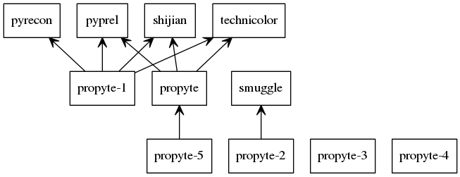

# propyte

# quick start

The following Bash commands, that have been tested on Ubuntu 14.10, should install prerequisites, check out propyte and then generate UML diagrams of the code.

```Bash
sudo pip install docopt
sudo pip install pyfiglet
sudo apt-get -y install graphviz libgraphviz-dev python-dev
sudo pip install pylint pygraphviz
git clone https://github.com/wdbm/propyte.git
cd propyte/
wget https://raw.githubusercontent.com/wdbm/pyprel/master/pyprel.py
wget https://raw.githubusercontent.com/wdbm/pyrecon/master/pyrecon.py
wget https://raw.githubusercontent.com/wdbm/shijian/master/shijian.py
wget https://raw.githubusercontent.com/wdbm/technicolor/master/technicolor.py
./UML.sh
```

# introduction

This is a template Python program.

# UML

UML diagrams of a Python project can be generated using Pylint and Graphviz. This can be done by executing the Bash script ```UML.sh``` in the working directory of the project. This executes the following commands:

```Bash
projectName="${PWD##*/}"
pyreverse -my -A -o png -p ${projectName} **.py
```

This should generate two images, ```classes_propyte.png``` and ```packages_propyte.png```. The classes image is a representation of the classes of the project, their respective data attributes (with types), their respective methods and their inheritances. The packages image is a representation of the module dependencies of the project.



# prerequisites

## docopt

```Bash
sudo pip install docopt
```

## pyfiglet

```Bash
sudo pip install pyfiglet
```

## pyprel

- [pyprel](https://github.com/wdbm/pyprel)

## pyrecon

- [pyrecon](https://github.com/wdbm/pyrecon)

## shijian

- [shijian](https://github.com/wdbm/shijian)

## technicolor

- [technicolor](https://github.com/wdbm/technicolor)

## Pylint, Graphviz (UML prerequisites)

```Bash
sudo apt-get -y install graphviz libgraphviz-dev python-dev
sudo pip install pylint pygraphviz
```
